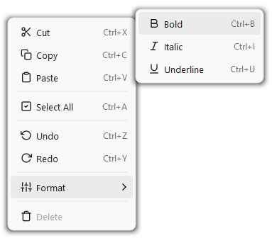
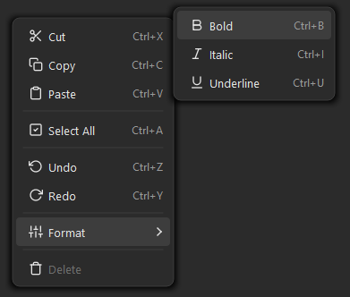

# Fluent Context Menu for PySide6

**Disclaimer:** This project is provided as-is, without warranty of any kind. Use it at your own risk. There is no guarantee of continued maintenance, updates, or bug fixes. The author assumes no liability for any issues arising from the use of this code in your projects.

A Windows 11 Fluent Design context menu for PySide6 — built entirely from scratch without `QMenu`.

Uses a frameless translucent popup with `QPainter`-drawn rounded corners and soft drop shadow. No QSS hacks, no rendering artefacts, reliable open/close lifecycle. 







## Features

- **Pixel-perfect rounded corners** — pure `QPainter`, no QSS artefact bleeding
- **Soft drop shadow** — painted as concentric rects with quadratic alpha falloff (faster than `QGraphicsDropShadowEffect`)
- **Smooth hover** — pill-shaped highlight per item via individual `enterEvent`/`leaveEvent`
- **Light & dark theme** — toggle with a single `dark_mode` bool
- **SVG icon support** — pass `QIcon("file.svg")` or use the built-in `svg_to_icon()` helper with theme-aware colorisation
- **Attach to any widget** — one call to `menu.attach(widget)`, no subclassing needed
- **Reliable lifecycle** — `Qt.WindowType.Popup` flag handles auto-close on outside click and Escape
- **Keyboard navigation** — Arrow keys, Enter, Escape
- **Separators, submenus, disabled items, checkable items**
- **Zero dependencies** beyond PySide6

## Why not QMenu?

`QMenu` has well-known issues when you try to style it with QSS:

| Problem | QMenu | This widget |
|---|---|---|
| Rounded corner artefacts | ✗ Background bleeds through corners | ✓ `QPainter` draws a clean rounded rect |
| Hover highlight | ✗ QSS `:hover` is unreliable on items | ✓ Individual `enterEvent`/`leaveEvent` per row |
| Opens only once | ✗ Common bug with styled QMenu | ✓ Popup flag handles lifecycle correctly |
| Drop shadow | ✗ `QGraphicsDropShadowEffect` is slow | ✓ Concentric rects, ~0.2 ms paint time |

## Installation

Single file — just copy `fluent_context_menu.py` into your project:

```bash
# Or clone the repo
git clone https://github.com/MaxGroiss/fluent-pyside6-context-menu.git
```

**Requires:** PySide6 ≥ 6.7 (tested with 6.10.2), Python ≥ 3.10

## Quick Start

```python
from fluent_context_menu import FluentContextMenu

# Create menu
menu = FluentContextMenu(dark_mode=True)
menu.add_item("Cut",   shortcut="Ctrl+X", callback=lambda: print("cut"))
menu.add_item("Copy",  shortcut="Ctrl+C", callback=lambda: print("copy"))
menu.add_item("Paste", shortcut="Ctrl+V", callback=lambda: print("paste"))
menu.add_separator()
menu.add_item("Delete", enabled=False)

# Attach to any widget
menu.attach(my_text_edit)
```

## Icons

Three ways to add icons:

```python
from PySide6.QtGui import QIcon, QColor
from fluent_context_menu import FluentContextMenu, svg_to_icon

menu = FluentContextMenu(dark_mode=True)

# 1. SVG file on disk
menu.add_item("Save", icon=QIcon("icons/save.svg"))

# 2. Inline SVG string (theme-aware via color parameter)
my_svg = '<svg xmlns="http://www.w3.org/2000/svg" ...stroke="currentColor"...>...</svg>'
menu.add_item("Save", icon=svg_to_icon(my_svg, color=QColor(228, 228, 228)))

# 3. Any QIcon (PNG, resource system, etc.)
menu.add_item("Save", icon=QIcon(":/icons/save.png"))
```

When using `svg_to_icon()` with `stroke="currentColor"` SVGs, pass `color=` to adapt to your theme. The demo shows this pattern with 15 built-in Lucide icons.

## Reacting to Clicks

Three complementary patterns:

### 1. Callback (fire-and-forget)

```python
menu.add_item("Save", callback=lambda: document.save())
```

### 2. Signal (observer pattern)

```python
def on_action(text: str, item_def: MenuItemDef):
    print(f"{text} triggered, checked={item_def.checked}")

menu.action_triggered.connect(on_action)
```

### 3. ItemDef reference (stateful items)

```python
grid_item = menu.add_item("Show Grid", checkable=True, checked=True)

# Query state any time after user interaction:
if grid_item.checked:
    canvas.enable_grid()
```

## Submenus

```python
menu = FluentContextMenu(dark_mode=True)
menu.add_item("Cut", shortcut="Ctrl+X")
menu.add_separator()

# add_submenu returns a new FluentContextMenu
format_menu = menu.add_submenu("Format", icon=my_icon)
format_menu.add_item("Bold",      shortcut="Ctrl+B")
format_menu.add_item("Italic",    shortcut="Ctrl+I")
format_menu.add_item("Underline", shortcut="Ctrl+U")

menu.attach(editor)
```

## Theme Switching

```python
menu = FluentContextMenu(dark_mode=False)

# Switch at any time — popup is rebuilt automatically
menu.dark_mode = True
```

You can also access the built-in theme objects (`DARK`, `LIGHT`) for icon colorisation:

```python
from fluent_context_menu import DARK, LIGHT, svg_to_icon

theme = DARK if is_dark else LIGHT
icon = svg_to_icon(my_svg, color=theme.icon_color)
```

## API Reference

### `FluentContextMenu`

| Method | Description |
|---|---|
| `add_item(text, *, callback, icon, shortcut, enabled, checkable, checked)` | Add a menu item. Returns `MenuItemDef`. |
| `add_separator()` | Add a horizontal line. |
| `add_submenu(text, *, icon)` | Add a submenu. Returns child `FluentContextMenu`. |
| `attach(widget)` | Bind context menu to a widget (right-click opens it). |
| `detach(widget)` | Unbind from a widget. |
| `show_at(global_pos)` | Show programmatically at screen coordinates. |
| `clear()` | Remove all items. |

| Property | Description |
|---|---|
| `dark_mode` | `bool` — get/set theme. Invalidates popup cache on change. |
| `action_triggered` | `Signal(str, MenuItemDef)` — emitted on any item click. |

### `MenuItemDef`

Returned by `add_item()`. Mutable fields you can read/write:

| Field | Type | Description |
|---|---|---|
| `text` | `str` | Display label |
| `checked` | `bool` | Current check state (for checkable items) |
| `enabled` | `bool` | Whether the item is interactive |

### `svg_to_icon(svg_string, size=16, color=None)`

Create a `QIcon` from an SVG string. If `color` is given, replaces `currentColor` with that colour.

## Running the Demo

```bash
pip install PySide6
python demo.py
```

Right-click the text editor or the coloured panel. Toggle the dark mode checkbox to see theme switching in action.

## Architecture

```
FluentContextMenu (QObject)          ← Public API, manages items & attach
  └── _MenuPopup (QWidget)           ← Frameless translucent popup
        ├── _MenuItemWidget (QWidget) ← One per item, custom QPainter
        ├── _SeparatorWidget (QWidget)
        ├── _MenuItemWidget
        └── ...
```

- **No QMenu** — avoids all QSS styling issues
- **No QListView** — simple `QVBoxLayout` is faster for 5–20 items
- **No QGraphicsDropShadowEffect** — manual shadow is ~10× faster
- **Lazy build** — popup widget tree is created on first show, cached, and invalidated on theme/item change
- **`Qt.WindowType.Popup`** — gives us native auto-dismiss behaviour for free

## License

MIT — do whatever you want. See [LICENSE](LICENSE).
